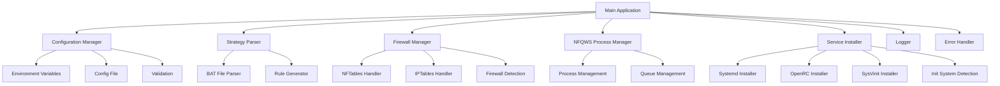

# Zapret Discord YouTube - Go Edition Architecture

## Overview

This document describes the architecture for the Go version of the Zapret Discord YouTube network filtering system. The Go implementation will provide better performance, modern Go practices, and improved maintainability while preserving all functionality of the original bash version.

## System Architecture



## Core Components

### 1. Configuration Management

**Responsibilities:**
- Load configuration from environment variables and config files
- Validate configuration parameters
- Provide type-safe access to configuration values
- Support hot-reloading of configuration

**Implementation:**
- Use `github.com/spf13/viper` for configuration management
- Implement custom validation logic
- Support YAML file format (`conf.yml`) and environment variables
- Use generics for type-safe configuration access

### 2. Strategy Parser

**Responsibilities:**
- Parse BAT strategy files
- Extract firewall rules and NFQWS parameters
- Handle GameFilter port substitutions
- Generate structured rule sets

**Implementation:**
- Use generics for flexible rule processing
- Implement efficient file parsing with buffering
- Support template variables (%BIN%, %LISTS%, %GameFilter%)
- Generate optimized rule structures

### 3. Firewall Manager

**Responsibilities:**
- Detect available firewall (nftables/iptables)
- Apply firewall rules
- Clean up firewall rules
- Manage firewall state

**Implementation:**
- Use context for timeout management
- Implement interface-based design for firewall backends
- Support both nftables and iptables
- Use structured logging for firewall operations

### 4. NFQWS Process Manager

**Responsibilities:**
- Manage nfqws processes
- Handle process lifecycle
- Manage queue assignments
- Monitor process health

**Implementation:**
- Use `os/exec` for process management
- Implement context-based process control
- Support graceful shutdown
- Monitor process status with channels

### 5. Service Installer

**Responsibilities:**
- Detect init system (systemd/openrc/sysvinit)
- Install/uninstall service
- Manage service lifecycle
- Generate service configuration files

**Implementation:**
- Use template-based service file generation
- Support multiple init systems
- Implement idempotent installation
- Provide status checking

### 6. Logging System

**Responsibilities:**
- Structured logging
- Log level management
- Context-aware logging
- Performance monitoring

**Implementation:**
- Use `log/slog` for structured logging
- Support JSON and console output
- Implement log rotation
- Add performance metrics

### 7. Error Handling

**Responsibilities:**
- Comprehensive error handling
- Error wrapping and unwrapping
- Custom error types
- Graceful degradation

**Implementation:**
- Use `errors.Is()` and `errors.As()` patterns
- Implement custom error types
- Provide detailed error contexts
- Support error metrics

## Package Structure

```
go_edition/
├── cmd/
│   ├── zapret/
│   │   └── main.go          # Main application entry point
├── internal/
│   ├── config/             # Configuration management
│   ├── strategy/           # Strategy parsing
│   ├── firewall/           # Firewall management
│   ├── nfqws/              # NFQWS process management
│   ├── service/            # Service installation
│   ├── logging/            # Logging system
│   └── errors/             # Error handling
├── pkg/
│   ├── api/                # Public API (if needed)
│   └── utils/              # Shared utilities
├── scripts/               # Helper scripts
├── configs/               # Example configurations
├── Dockerfile             # Docker build configuration
├── Makefile               # Build automation
├── go.mod                 # Go module definition
└── go.sum                 # Go dependencies
```

## Key Design Decisions

### 1. Context Usage

All long-running operations will use `context.Context` for:
- Timeout management
- Cancellation support
- Request tracing
- Graceful shutdown

### 2. Generics

Use Go generics for:
- Configuration value access
- Strategy rule processing
- Collection operations
- Error handling wrappers

### 3. Dependency Injection

Use constructor injection for:
- Configuration dependencies
- Logger dependencies
- Firewall backend selection
- Service installer selection

### 4. Error Handling

Implement comprehensive error handling with:
- Custom error types
- Error wrapping
- `errors.Is()` and `errors.As()` patterns
- Detailed error contexts

### 5. Performance Optimizations

Key optimizations:
- Efficient file parsing with buffering
- Minimal memory allocations
- Concurrent rule processing
- Lazy initialization
- Connection pooling for external calls

## Implementation Plan

### Phase 1: Core Infrastructure
1. Project setup and module initialization
2. Configuration management system
3. Logging system implementation
4. Error handling framework
5. Basic CLI interface

### Phase 2: Core Functionality
1. Strategy parser implementation
2. Firewall manager (nftables first)
3. NFQWS process manager
4. Service installer (systemd first)

### Phase 3: Advanced Features
1. IPTables support
2. OpenRC and SysVinit support
3. Performance optimizations
4. Comprehensive testing

### Phase 4: Deployment
1. Dockerfile creation
2. Makefile automation
3. Self-installation mechanism
4. Documentation

## Migration Strategy

The Go version will:
1. Maintain full compatibility with existing BAT strategy files
2. Support the same configuration format
3. Provide identical CLI interface
4. Support the same service installation methods
5. Maintain backward compatibility with existing workflows

## Testing Strategy

1. Unit tests for all core components
2. Integration tests for key workflows
3. End-to-end testing of complete scenarios
4. Performance benchmarking
5. Error condition testing

## Documentation

1. Comprehensive godoc documentation
2. Example configurations
3. Usage guide
4. Migration guide from bash version
5. API documentation (if applicable)
