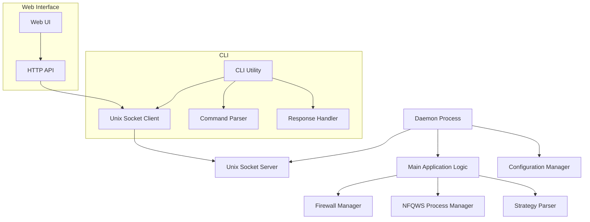

# Daemon + CLI Architecture for Zapret Discord YouTube

## Overview

This document describes the transformation of the current application into a daemon architecture with a separate CLI utility for control. The daemon will run as a background service and communicate with clients via Unix sockets or HTTP API.

## Current Architecture Analysis

The current architecture includes:
- System service installation (systemd, openrc, sysvinit)
- Service lifecycle management (install, remove, start, stop, status)
- Complex init system detection
- Service file generation with templates
- CLI commands integrated into main binary

## New Architecture Design

### Core Components



### Key Changes

1. **Daemon Process**: Runs as background service
2. **IPC Communication**: Unix socket for local communication
3. **Separate CLI**: Dedicated CLI utility for control
4. **Remove Service Management**: Eliminate system service installation
5. **Simplified Deployment**: Use package manager or manual installation

## Detailed Component Design

### 1. Daemon Process

**Location**: `go_edition/cmd/zapret-daemon/main.go`

**Responsibilities**:
- Run as long-lived background process
- Manage Unix socket server for IPC
- Handle firewall rules and NFQWS processes
- Manage application state
- Handle graceful shutdown

**Implementation**:
```go
func main() {
    // Initialize logging
    logging.Initialize(nil)
    slog.Info("Starting Zapret Daemon")
    
    // Parse command line flags
    configPath := flag.String("config", "/etc/zapret/conf.yml", "Path to config file")
    socketPath := flag.String("socket", "/var/run/zapret.sock", "Unix socket path")
    flag.Parse()
    
    // Load configuration
    cfg, err := config.Load(context.Background(), *configPath)
    if err != nil {
        slog.Error("Failed to load configuration", "error", err)
        os.Exit(1)
    }
    
    // Start IPC server
    ipcServer := ipc.NewUnixSocketServer(*socketPath)
    go ipcServer.Start()
    defer ipcServer.Stop()
    
    // Start main application
    ctx, cancel := context.WithCancel(context.Background())
    defer cancel()
    
    // Handle signals
    go handleSignals(cancel, ipcServer)
    
    // Initialize and run application
    app := NewApplication(ctx, cfg, ipcServer)
    if err := app.Run(); err != nil {
        slog.Error("Application failed", "error", err)
        os.Exit(1)
    }
}
```

### 2. IPC Server (Unix Socket)

**Location**: `go_edition/internal/ipc/server.go`

**Responsibilities**:
- Handle Unix socket communication
- Process incoming commands
- Return responses to clients
- Manage multiple concurrent connections

**Implementation**:
```go
type UnixSocketServer struct {
    path       string
    listener   net.Listener
    app        *Application
    commandMap map[string]CommandHandler
}

type CommandHandler func(ctx context.Context, params map[string]interface{}) (interface{}, error)

func NewUnixSocketServer(path string) *UnixSocketServer {
    return &UnixSocketServer{
        path:       path,
        commandMap: make(map[string]CommandHandler),
    }
}

func (s *UnixSocketServer) Start() error {
    // Remove existing socket if present
    if err := os.Remove(s.path); err != nil && !os.IsNotExist(err) {
        return fmt.Errorf("failed to remove existing socket: %w", err)
    }
    
    // Create Unix socket listener
    listener, err := net.Listen("unix", s.path)
    if err != nil {
        return fmt.Errorf("failed to listen on Unix socket: %w", err)
    }
    s.listener = listener
    
    slog.Info("IPC server started", "socket", s.path)
    
    // Accept connections
    for {
        conn, err := listener.Accept()
        if err != nil {
            if !s.isClosed() {
                slog.Error("Failed to accept connection", "error", err)
            }
            return err
        }
        go s.handleConnection(conn)
    }
}

func (s *UnixSocketServer) RegisterCommand(name string, handler CommandHandler) {
    s.commandMap[name] = handler
}

func (s *UnixSocketServer) handleConnection(conn net.Conn) {
    defer conn.Close()
    
    // Read command
    buf := make([]byte, 4096)
    n, err := conn.Read(buf)
    if err != nil {
        slog.Error("Failed to read from connection", "error", err)
        return
    }
    
    // Parse and execute command
    var request Request
    if err := json.Unmarshal(buf[:n], &request); err != nil {
        sendError(conn, "invalid_request", err)
        return
    }
    
    // Find and execute handler
    handler, exists := s.commandMap[request.Command]
    if !exists {
        sendError(conn, "unknown_command", fmt.Errorf("command %s not found", request.Command))
        return
    }
    
    // Execute command and send response
    response, err := handler(context.Background(), request.Params)
    if err != nil {
        sendError(conn, request.Command, err)
        return
    }
    
    sendResponse(conn, request.Command, response)
}
```

### 3. CLI Utility

**Location**: `go_edition/cmd/zapret-cli/main.go`

**Responsibilities**:
- Connect to daemon via Unix socket
- Parse user commands
- Send commands to daemon
- Display responses
- Handle errors gracefully

**Implementation**:
```go
func main() {
    // Create root command
    rootCmd := &cobra.Command{
        Use:     "zapret-cli",
        Short:   "Zapret CLI - Control Zapret daemon",
        Long:    "Command line interface for controlling the Zapret daemon.",
        Version: fmt.Sprintf("%s (%s)", Version, BuildDate),
    }
    
    // Add subcommands
    rootCmd.AddCommand(createStatusCommand())
    rootCmd.AddCommand(createStartCommand())
    rootCmd.AddCommand(createStopCommand())
    rootCmd.AddCommand(createRestartCommand())
    rootCmd.AddCommand(createConfigCommand())
    rootCmd.AddCommand(createDebugCommand())
    
    // Execute the command
    if err := rootCmd.Execute(); err != nil {
        fmt.Fprintf(os.Stderr, "Error: %v\n", err)
        os.Exit(1)
    }
}

func createStatusCommand() *cobra.Command {
    return &cobra.Command{
        Use:   "status",
        Short: "Check daemon status",
        RunE: func(cmd *cobra.Command, args []string) error {
            client := ipc.NewUnixSocketClient("/var/run/zapret.sock")
            
            var response StatusResponse
            if err := client.SendCommand("status", nil, &response); err != nil {
                return fmt.Errorf("failed to get status: %w", err)
            }
            
            fmt.Printf("Daemon Status: %s\n", response.Status)
            fmt.Printf("Uptime: %s\n", response.Uptime)
            fmt.Printf("Firewall Rules: %d\n", response.FirewallRules)
            fmt.Printf("NFQWS Processes: %d\n", response.NFQWSProcesses)
            
            return nil
        },
    }
}
```

### 4. IPC Client

**Location**: `go_edition/internal/ipc/client.go`

**Responsibilities**:
- Connect to Unix socket
- Send commands to daemon
- Receive and parse responses
- Handle connection errors

**Implementation**:
```go
type UnixSocketClient struct {
    socketPath string
    timeout    time.Duration
}

func NewUnixSocketClient(socketPath string) *UnixSocketClient {
    return &UnixSocketClient{
        socketPath: socketPath,
        timeout:    5 * time.Second,
    }
}

func (c *UnixSocketClient) SendCommand(command string, params interface{}, response interface{}) error {
    // Connect to Unix socket
    conn, err := net.DialTimeout("unix", c.socketPath, c.timeout)
    if err != nil {
        return fmt.Errorf("failed to connect to daemon: %w", err)
    }
    defer conn.Close()
    
    // Create request
    request := Request{
        Command: command,
        Params:  params,
    }
    
    // Send request
    data, err := json.Marshal(request)
    if err != nil {
        return fmt.Errorf("failed to marshal request: %w", err)
    }
    
    if _, err := conn.Write(data); err != nil {
        return fmt.Errorf("failed to send request: %w", err)
    }
    
    // Read response
    buf := make([]byte, 4096)
    n, err := conn.Read(buf)
    if err != nil {
        return fmt.Errorf("failed to read response: %w", err)
    }
    
    // Parse response
    var resp Response
    if err := json.Unmarshal(buf[:n], &resp); err != nil {
        return fmt.Errorf("failed to parse response: %w", err)
    }
    
    // Check for errors
    if resp.Error != "" {
        return fmt.Errorf("daemon error: %s", resp.Error)
    }
    
    // Unmarshal data into response
    if response != nil {
        if err := json.Unmarshal(resp.Data, response); err != nil {
            return fmt.Errorf("failed to unmarshal response data: %w", err)
        }
    }
    
    return nil
}
```

### 5. Application Commands

**Location**: `go_edition/internal/ipc/commands.go`

**Responsibilities**:
- Define available commands
- Implement command handlers
- Manage application state
- Return appropriate responses

**Implementation**:
```go
func RegisterCommands(app *Application, server *UnixSocketServer) {
    server.RegisterCommand("status", app.handleStatusCommand)
    server.RegisterCommand("start", app.handleStartCommand)
    server.RegisterCommand("stop", app.handleStopCommand)
    server.RegisterCommand("restart", app.handleRestartCommand)
    server.RegisterCommand("config", app.handleConfigCommand)
    server.RegisterCommand("firewall", app.handleFirewallCommand)
    server.RegisterCommand("processes", app.handleProcessesCommand)
}

func (app *Application) handleStatusCommand(ctx context.Context, params map[string]interface{}) (interface{}, error) {
    status := app.GetStatus()
    
    return StatusResponse{
        Status:          status.State.String(),
        Uptime:          time.Since(status.StartTime).String(),
        FirewallRules:   status.FirewallRules,
        NFQWSProcesses:  status.NFQWSProcesses,
        ConfigPath:      app.configPath,
        StrategyPath:    app.strategyPath,
    }, nil
}

func (app *Application) handleStartCommand(ctx context.Context, params map[string]interface{}) (interface{}, error) {
    if app.isRunning() {
        return nil, fmt.Errorf("daemon is already running")
    }
    
    if err := app.Start(); err != nil {
        return nil, fmt.Errorf("failed to start: %w", err)
    }
    
    return map[string]string{"status": "started"}, nil
}
```

## Configuration Changes

### Daemon Configuration

**Location**: `/etc/zapret/conf.yml`

**Changes**:
- Remove service-specific configuration
- Add IPC socket path configuration
- Keep firewall and NFQWS configuration
- Add daemon-specific settings

**Example**:
```yaml
# Daemon configuration
daemon:
  socket_path: "/var/run/zapret.sock"
  pid_file: "/var/run/zapret.pid"
  log_file: "/var/log/zapret/daemon.log"
  
# Existing configuration
firewall:
  interface: ""
  
strategy:
  path: "/etc/zapret/strategy.bat"
  game_filter_enabled: false
  
logging:
  level: "info"
  color: true
```

## Deployment Changes

### Systemd Service (Optional)

For users who want system integration, provide a simple systemd service file:

**Location**: `packages/systemd/zapret.service`

```ini
[Unit]
Description=Zapret Discord YouTube Daemon
After=network-online.target
Wants=network-online.target

[Service]
Type=simple
ExecStart=/usr/local/bin/zapret-daemon --config /etc/zapret/conf.yml
ExecStop=/usr/local/bin/zapret-cli stop
Restart=on-failure
RestartSec=5
User=root

[Install]
WantedBy=multi-user.target
```

### Installation Script

**Location**: `scripts/install.sh`

```bash
#!/bin/bash

# Install binary
install -m 755 zapret-daemon /usr/local/bin/zapret-daemon
install -m 755 zapret-cli /usr/local/bin/zapret-cli

# Create configuration directory
mkdir -p /etc/zapret

# Copy example configuration
cp configs/conf.yml.example /etc/zapret/conf.yml

# Create log directory
mkdir -p /var/log/zapret

# Set permissions
chown -R root:root /etc/zapret
chmod 600 /etc/zapret/conf.yml

echo "Installation complete!"
echo "To start the daemon: zapret-daemon &"
echo "To control the daemon: zapret-cli [command]"
```

## Benefits of New Architecture

1. **Clean Separation**: Daemon and CLI are separate processes
2. **Better Control**: CLI can control daemon without direct access to internals
3. **Extensibility**: Easy to add web interface or other clients
4. **Simplified Deployment**: No complex service installation logic
5. **Improved Security**: Unix socket provides secure local communication
6. **Better State Management**: Daemon maintains application state
7. **Multiple Clients**: Support for CLI, web UI, and other interfaces

## Backward Compatibility

The new architecture will:
- Maintain the same core functionality
- Support existing configuration format
- Provide similar CLI interface
- Keep the same firewall and NFQWS management
- Allow gradual migration from service-based to daemon-based approach

## Implementation Plan

1. **Create IPC Server**: Implement Unix socket communication
2. **Create Daemon Entrypoint**: Move main logic to daemon
3. **Create CLI Utility**: Implement separate CLI with IPC client
4. **Remove Service Code**: Eliminate system service installation
5. **Update Configuration**: Add daemon-specific settings
6. **Create Installation Scripts**: Simplify deployment
7. **Testing**: Test daemon and CLI communication
8. **Documentation**: Update documentation for new architecture

## Migration Path

For existing users:
1. Install new daemon and CLI binaries
2. Update configuration file
3. Stop old service
4. Start new daemon
5. Use CLI for control

The transition should be seamless with minimal configuration changes required.